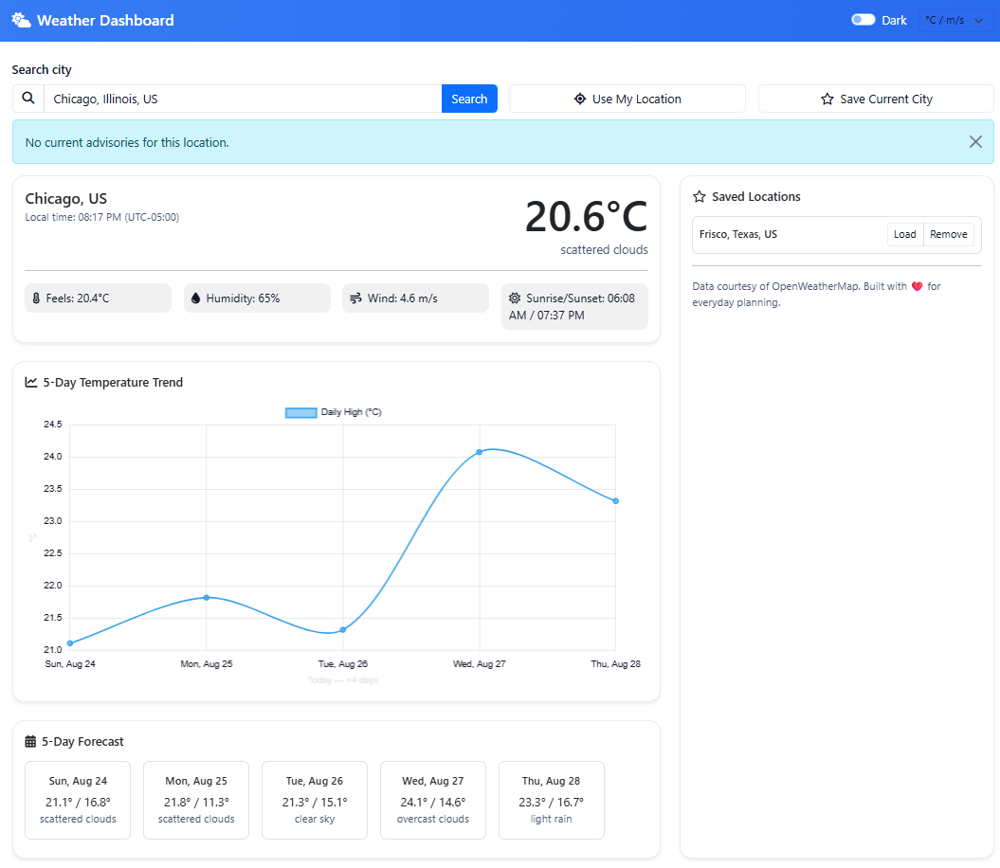
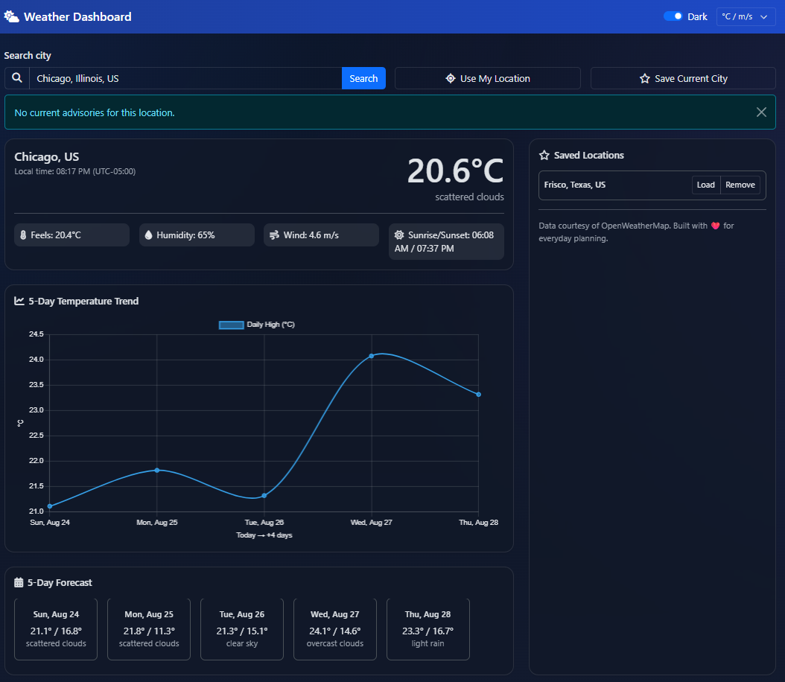

# Weather Dashboard with Alerts



This project is a full‑stack weather dashboard built with **Node.js**, **Express** and a lightweight vanilla **JavaScript** frontend.  It uses the [OpenWeatherMap](https://openweathermap.org/) API to retrieve current conditions and forecast data and presents them in a polished, responsive interface.  Features like location search, geolocation, interactive charts, custom alerts and theming make the app useful for everyday users as well as university admissions portfolios.

## Features

The design of this dashboard was inspired by common patterns found in leading weather apps.  Well‑regarded apps such as **The Weather Channel** provide a wealth of meteorological data like temperature, wind and visibility on an hourly or daily basis, along with extended 10‑day forecasts, interactive radar maps and severe weather alerts.  Other apps like **1Weather** offer 10‑day forecasts, live radar maps, severe weather warnings and minute‑by‑minute or hourly forecasts to help users plan ahead.  Based on these examples, this project implements a subset of those capabilities that are practical to build within an open‑source portfolio project.

Key features include:

* **Location search** – Enter any city name to fetch current weather and a 5‑day forecast.
* **Geolocation** – Use your device’s built‑in geolocation to get the forecast for your current position.
* **Current conditions card** – Displays temperature, “feels like” temperature, humidity, wind speed/direction, sunrise and sunset times, a weather icon and a descriptive summary.
* **Custom advisories** – Simple alerts are generated based on thresholds for extreme heat/cold, strong winds, thunderstorms or snow.  These provide guidance similar to the severe weather alerts found in top apps.
* **Interactive 5‑day forecast chart** – A line chart visualises temperature trends for the next several days.  Hovering over the chart reveals exact values.
* **Unit toggle** – Switch between metric (°C, m/s) and imperial (°F, mph) units.
* **Dark/light theme** – A built‑in theme switcher allows you to choose a light or dark colour scheme; your choice is remembered between sessions.
* **Saved locations** – Favourite cities are stored in your browser’s local storage and can be reloaded or removed with one click.
* **Responsive design** – Built with Bootstrap and custom CSS variables to look good on desktop and mobile devices.

## Getting started

Follow these steps to run the project locally on your computer.  The instructions assume you have **Node.js** (version 16 or later) and **npm** installed.

1. **Clone the repository.**
   ```bash
   git clone https://github.com/yourusername/weather-dashboard-alerts.git
   cd weather-dashboard-alerts
   ```

2. **Install dependencies.**
   ```bash
   npm install
   ```

3. **Set up your API key.**
   - Create a free account at [OpenWeatherMap](https://openweathermap.org/api) and generate an API key.
   - Copy `.env.sample` to `.env` and replace `your_api_key_here` with your actual key.
     ```bash
     cp .env.sample .env
     # then edit .env and set OPENWEATHER_API_KEY
     ```

4. **Start the server.**
   ```bash
   npm start
   ```
   The application will run on [http://localhost:3000](http://localhost:3000/).  Open this URL in your browser to use the dashboard.

## Project structure

```text
weather-dashboard-alerts/
│
├── server.js            # Express server that proxies API requests
├── package.json         # Project metadata and dependencies
├── .env.sample          # Sample environment variables file
├── public/
│   ├── index.html       # Main HTML page
│   ├── css/
│   │   └── style.css    # Styles and theme variables
│   └── js/
│       └── main.js      # Frontend logic for fetching data and updating the UI
└── README.md            # Documentation (this file)
```

### How it works

When a user searches for a city or uses geolocation, the browser calls the Express API endpoints:

* `GET /api/weather` – Returns current weather conditions for a given city name or latitude/longitude.
* `GET /api/forecast` – Returns a simplified 5‑day forecast.  The server groups OpenWeather’s 3‑hourly forecast data into daily values around noon to keep the chart concise.

The server always requests data in metric units and performs minimal processing.  All unit conversions (C ⇄ F and m/s ⇄ mph), theme toggling and favourites handling happen in the client using vanilla JavaScript.

## Deployment guide

You can host this app for free or at low cost using cloud platforms.  Here are two common deployment strategies:

### 1. Full stack on Render or Fly.io

Platforms like [Render](https://render.com/) or [Fly.io](https://fly.io/) allow you to deploy Node.js servers easily.

1. Create an account on your chosen platform.
2. Connect your GitHub repository and select it for deployment.
3. Add an environment variable `OPENWEATHER_API_KEY` with your API key.
4. Choose a build command of `npm install` and a start command of `npm start`.
5. Deploy the service; your Node server will serve both the API and static frontend.

### 2. Static frontend on GitHub Pages with a separate backend

If you prefer to host the frontend separately (for example on GitHub Pages) and run the backend on another platform, follow these steps:

1. Build your frontend (the contents of the `public` folder) and push it to a separate branch, such as `gh-pages`, in your GitHub repository.  GitHub Pages can then serve the static files.
2. Deploy the backend (`server.js`) to a platform that supports Node.js (e.g. Render, Fly.io, or an inexpensive VPS).  Ensure that CORS is enabled on your backend (already configured in this project).
3. In `public/js/main.js`, change the API base URL from `'/api'` to the URL of your deployed backend (e.g. `https://your-backend.onrender.com/api`).
4. Commit and redeploy.

With this separation, your static site will be served by GitHub Pages, while API requests are proxied to your backend.  This pattern can reduce hosting costs if the frontend receives high traffic.

## Extending the project

There are many ways to enhance this dashboard further:

* **Radar and map view:** integrate an interactive map (e.g. Leaflet or Mapbox) with radar layers to approximate features like those found in professional apps.
* **Hourly forecast:** display 24‑ or 48‑hour temperature and precipitation probabilities similar to the minute‑by‑minute forecasts in 1Weather.
* **Air quality and pollen index:** call additional APIs to display health‑related indices.
* **Push notifications:** send browser notifications when custom alerts are triggered.
* **Progressive Web App (PWA):** add offline caching and installability for a more native feel.

Feel free to fork this repository and experiment with new ideas.